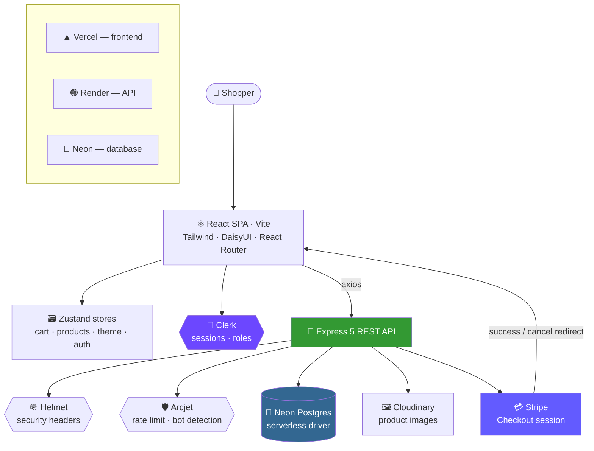
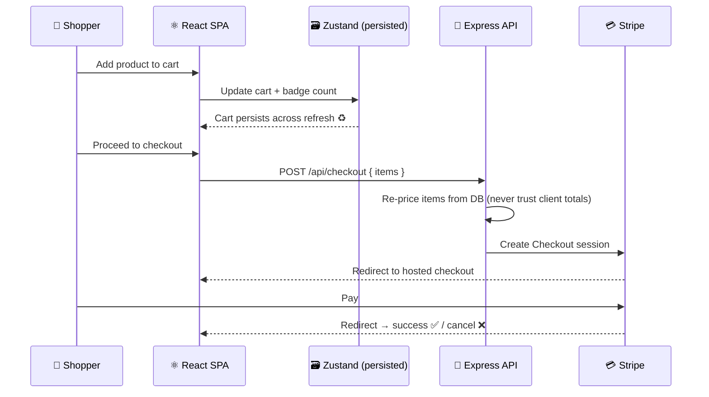
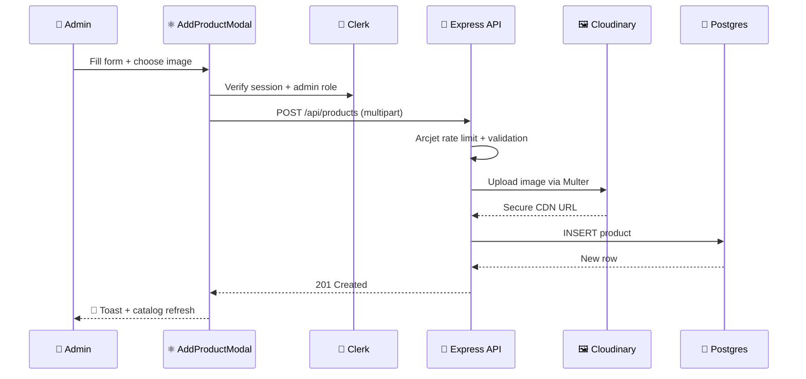

<div align="center">

# 🛒 NextonicStore

### A modern full-stack e-commerce platform

**Browse, cart, and checkout — with a Stripe-powered payment flow, role-based admin panel, and a themeable UI that looks good in the dark.**

[](https://product-store-wheat.vercel.app/)
[](https://productstore-1hrq.onrender.com)
[](https://github.com/shubhamraj2604/ProductStore)

<br/>


<br/>

<!-- 📸 Drop a screenshot or GIF of the storefront here — it's the single biggest upgrade this README can get.
 -->

</div>

---

## 📖 Table of Contents

| | | |
|---|---|---|
| [✨ Overview](#-overview) | [🚀 Features](#-features) | [🏛️ Architecture](#️-architecture) |
| [🧠 Tech Stack](#-tech-stack) | [⚡ Getting Started](#-getting-started) | [🔑 Environment Variables](#-environment-variables) |
| [🗄️ Database Setup](#️-database-setup) | [🔌 API Reference](#-api-reference) | [🔄 Key Flows](#-key-flows) |
| [🗂️ Project Structure](#️-project-structure) | [🔐 Security](#-security) | [🚢 Deployment](#-deployment) |

---

## ✨ Overview

NextonicStore is a complete storefront: a React SPA on the front, an Express REST API on the back, and a real payment path in between. Products are managed by admins through a protected panel, customers build a cart that survives a refresh, and checkout hands off to **Stripe** rather than faking it.

| | |
|---|---|
| 🛍️ **For shoppers** | Browse the catalog, view product details, manage a persistent cart, pay via Stripe |
| 🛠️ **For admins** | Role-gated product CRUD with image upload — no database console required |
| 🏗️ **Architecture** | Decoupled SPA + REST API; frontend on Vercel, API on Render, Postgres on Neon |
| 🛡️ **Hardening** | Helmet security headers, Arcjet rate limiting & bot protection, CORS allow-list |
| 🎨 **UI** | TailwindCSS + DaisyUI with a live theme switcher, including dark mode |

---

## 🚀 Features

<table>
<tr>
<td width="50%" valign="top">

### 🛍️ Product Catalog
Responsive grid of products with individual detail pages, loading states, and graceful empty/error states.

</td>
<td width="50%" valign="top">

### 🛒 Persistent Shopping Cart
Add, remove, and update quantities. Cart state lives in **Zustand** with persistence, so it survives refreshes and new sessions.

</td>
</tr>
<tr>
<td width="50%" valign="top">

### 💳 Stripe Checkout
Real hosted checkout with dedicated **success** and **cancel** return flows — totals are calculated server-side, never trusted from the client.

</td>
<td width="50%" valign="top">

### 🔐 Clerk Authentication
Secure sign-up and sign-in, managed sessions, and `ProtectedRoute` guards on everything that needs a logged-in user.

</td>
</tr>
<tr>
<td width="50%" valign="top">

### 👑 Admin Panel
**Role-based access control** — admins get create / update / delete on products through a modal UI; regular users only ever see the storefront.

</td>
<td width="50%" valign="top">

### 🖼️ Image Uploads
Product images handled with **Multer** + **Cloudinary**, so the app stores URLs instead of blobs and images are served from a CDN.

</td>
</tr>
<tr>
<td width="50%" valign="top">

### 🌗 Theme Switcher
DaisyUI themes with a live selector and dark mode, persisted per user in its own Zustand store.

</td>
<td width="50%" valign="top">

### 🔔 Instant Feedback
**React Hot Toast** notifications on every mutation — add to cart, product created, request failed — plus a live cart badge count.

</td>
</tr>
<tr>
<td width="50%" valign="top">

### 🛡️ Hardened API
**Helmet** headers, **Arcjet** rate limiting and bot detection, CORS allow-listing, and centralised error handling on every route.

</td>
<td width="50%" valign="top">

### 📱 Fully Responsive
Mobile-first layouts that hold up from phone to desktop, with **Morgan** request logging on the server for debugging.

</td>
</tr>
</table>

---

## 🏛️ Architecture



---

## 🧠 Tech Stack

<div align="center">

| Layer | Technology |
|---|---|
| **Frontend framework** | React 19 + Vite |
| **Styling** | TailwindCSS · DaisyUI (multi-theme + dark mode) |
| **Routing** | React Router DOM 7 |
| **State** | Zustand (cart, products, theme, auth) |
| **Icons / UX** | Lucide React · React Hot Toast |
| **HTTP client** | Axios |
| **Runtime** | Node.js |
| **API framework** | Express 5 |
| **Database** | PostgreSQL on Neon (`@neondatabase/serverless`) |
| **Auth** | Clerk (sessions + role-based access) |
| **Payments** | Stripe Checkout |
| **Media** | Multer (upload) → Cloudinary (storage + CDN) |
| **Security** | Helmet · Arcjet · CORS |
| **Logging** | Morgan |
| **Dev tooling** | Nodemon |
| **Hosting** | Vercel (frontend) · Render (API) · Neon (DB) |

</div>

---

## ⚡ Getting Started

### Prerequisites

- **Node.js 18+** and npm
- A **Neon** (or any PostgreSQL) database
- A **Clerk** application
- *Optional:* Stripe, Cloudinary, and Arcjet accounts for payments, uploads, and rate limiting

### Installation

```bash
# 1 — Clone
git clone https://github.com/shubhamraj2604/ProductStore.git
cd ProductStore

# 2 — Install backend + frontend dependencies
npm install
npm install --prefix frontend

# 3 — Configure environment (see the table below)
cp .env.example .env

# 4 — Create the products table (SQL below)

# 5 — Run the API (port 3000)
npm run dev

# 6 — In a second terminal, run the frontend
cd frontend && npm run dev
```

Frontend runs on **http://localhost:5173**, API on **http://localhost:3000** 🎉

### Production build

```bash
npm run build   # installs deps and builds the frontend
npm start       # serves the API (and the built SPA)
```

---

## 🔑 Environment Variables

Create a `.env` in the **project root** (backend):

| Variable | Required | Description |
|---|:---:|---|
| `PGHOST` | ✅ | Neon / Postgres host |
| `PGUSER` | ✅ | Database user |
| `PGPASSWORD` | ✅ | Database password |
| `PGDATABASE` | ✅ | Database name |
| `PGPORT` | ✅ | Database port (default `5432`) |
| `PORT` | ⬜ | API port (default `3000`) |
| `NODE_ENV` | ⬜ | `development` \| `production` |
| `CLIENT_URL` | ⬜ | Frontend origin — used for CORS + Stripe redirects |
| `STRIPE_SECRET_KEY` | ⬜ | Stripe secret key for Checkout sessions |
| `ARCJET_KEY` | ⬜ | Arcjet key — rate limiting is skipped if unset |
| `CLOUDINARY_CLOUD_NAME` | ⬜ | Cloudinary account name |
| `CLOUDINARY_API_KEY` | ⬜ | Cloudinary API key |
| `CLOUDINARY_API_SECRET` | ⬜ | Cloudinary API secret |

And a `frontend/.env` for the client:

| Variable | Required | Description |
|---|:---:|---|
| `VITE_CLERK_PUBLISHABLE_KEY` | ✅ | Clerk publishable key |
| `VITE_API_URL` | ⬜ | Base URL of the API (defaults to localhost in dev) |

> ⚠️ Never commit `.env`. Secret keys stay server-side — anything prefixed `VITE_` is bundled into the browser build and is public.

---

## 🗄️ Database Setup

```sql
CREATE TABLE products (
    id          SERIAL PRIMARY KEY,
    name        VARCHAR(255)   NOT NULL,
    price       DECIMAL(10,2)  NOT NULL,
    image       TEXT,
    created_at  TIMESTAMP DEFAULT CURRENT_TIMESTAMP
);
```

---

## 🔌 API Reference

**Base URL:** `http://localhost:3000/api` · **Production:** `https://productstore-1hrq.onrender.com/api`

### Products

| Method | Endpoint | Description | Access |
|:---:|---|---|:---:|
| `GET` | `/api/products` | List all products | 🌐 Public |
| `GET` | `/api/products/:id` | Fetch a single product | 🌐 Public |
| `POST` | `/api/products` | Create a product (with image upload) | 👑 Admin |
| `PUT` | `/api/products/:id` | Update a product | 👑 Admin |
| `DELETE` | `/api/products/:id` | Delete a product | 👑 Admin |

<details>
<summary><b>Example — create a product</b></summary>

```bash
curl -X POST https://productstore-1hrq.onrender.com/api/products \
  -F "name=Wireless Headphones" \
  -F "price=2499.00" \
  -F "image=@./headphones.jpg"
```

```json
{
  "success": true,
  "data": {
    "id": 12,
    "name": "Wireless Headphones",
    "price": "2499.00",
    "image": "https://res.cloudinary.com/.../headphones.jpg",
    "created_at": "2026-08-16T10:24:11.000Z"
  }
}
```

</details>

### Users & Checkout

| Method | Endpoint | Description |
|:---:|---|---|
| `POST` | `/api/users/...` | Clerk-backed user sync / login handling |
| `POST` | `/api/checkout` | Create a Stripe Checkout session for the cart |

> All routes pass through Helmet, CORS, Arcjet rate limiting, and Morgan logging before reaching a controller.

---

## 🔄 Key Flows

### Add to cart → Stripe checkout



### Admin creates a product



---

## 🗂️ Project Structure

```
ProductStore/
├── backend/
│   ├── config/
│   │   └── db.js                    # Neon serverless connection
│   ├── controllers/
│   │   ├── productController.js     # Product CRUD + Cloudinary upload
│   │   └── loginusers.js            # User auth handling
│   ├── lib/
│   │   └── arcjet.js                # Rate limiting & bot protection rules
│   ├── routes/
│   │   ├── productRoutes.js         # /api/products
│   │   └── userRoutes.js            # /api/users
│   └── server.js                    # Express app, middleware, static SPA serve
├── frontend/
│   ├── src/
│   │   ├── components/
│   │   │   ├── AddProductModal.jsx  # Admin product creation
│   │   │   ├── Navbar.jsx           # Nav + cart badge
│   │   │   ├── ProductCard.jsx      # Catalog card
│   │   │   ├── ProtectedRoute.jsx   # Auth guard
│   │   │   └── ThemeSelector.jsx    # DaisyUI theme switcher
│   │   ├── pages/
│   │   │   ├── Hero.jsx             # Landing hero
│   │   │   ├── HomePage.jsx         # Product listing
│   │   │   ├── ProductPage.jsx      # Product detail
│   │   │   └── CartPage.jsx         # Cart + checkout
│   │   ├── store/
│   │   │   ├── useAddtoCart.js      # Persistent cart state
│   │   │   ├── useProduct.js        # Product fetching/caching
│   │   │   ├── useLogin.js          # Auth state
│   │   │   └── useThemeStore.js     # Theme state
│   │   └── App.jsx                  # Routes + layout
│   └── dist/                        # Production build
└── package.json                     # Root scripts (runs backend + builds frontend)
```

---

## 🔐 Security

| Layer | Protection |
|---|---|
| 🪖 **Helmet** | Sets hardened HTTP security headers on every response |
| 🛡️ **Arcjet** | Rate limiting, bot detection, and shield rules in front of the API |
| 🌐 **CORS** | Cross-origin requests restricted to the known frontend origin |
| 🔐 **Clerk** | Session verification; `ProtectedRoute` blocks unauthenticated navigation |
| 👑 **RBAC** | Write operations on products are admin-only — enforced server-side, not just hidden in the UI |
| 💳 **Stripe** | Card data never touches this server; payment happens on Stripe-hosted checkout |
| 🧾 **Morgan** | Request logging for auditing and debugging |

---

## 🚢 Deployment

<table>
<tr><th align="left">▲ Frontend — Vercel</th><th align="left">🟢 Backend — Render</th><th align="left">🐘 Database — Neon</th></tr>
<tr valign="top">
<td>

- Vite production build
- SPA rewrites for React Router
- Clerk publishable key set as a build env var

</td>
<td>

- Express API as a web service
- Environment variables for DB, Stripe, Cloudinary, Arcjet
- Stripe success/cancel URLs pointed at the frontend

</td>
<td>

- Serverless Postgres
- Connected via `@neondatabase/serverless`
- `products` table created on setup

</td>
</tr>
</table>

**Live:** [Storefront](https://product-store-wheat.vercel.app/) · [API](https://productstore-1hrq.onrender.com)

---

## 📊 Roadmap

<table>
<tr><th align="left">✅ Shipped</th><th align="left">📌 Planned</th></tr>
<tr valign="top">
<td>

- Product catalog + detail pages
- Persistent shopping cart
- Clerk auth with protected routes
- Admin product CRUD
- Cloudinary image uploads
- Stripe Checkout with success/cancel flow
- Dark mode + theme switcher
- Helmet · Arcjet · CORS hardening

</td>
<td>

- Order history & persisted orders table
- Product search, filters, and categories
- Product reviews and ratings
- Wishlist / saved items
- Stripe webhooks for order fulfilment
- Admin dashboard with sales analytics
- Pagination and infinite scroll
- Automated tests + CI

</td>
</tr>
</table>

---

## 🤝 Contributing

```bash
# 1. Fork the repo
# 2. Create a branch
git checkout -b feature/amazing-feature
# 3. Commit
git commit -m "feat: add amazing feature"
# 4. Push and open a PR
git push origin feature/amazing-feature
```

---

## 🧑‍💻 Author

<div align="center">

**Shubham Raj**
Computer Science & Engineering — BIT Mesra

[](https://github.com/shubhamraj2604)
[](https://shubhamraj26.netlify.app/)

</div>

---

<div align="center">

### ⭐ If this project helped or inspired you

**Give it a star on GitHub — it genuinely helps!**

<sub>Built with React, Express, and a working checkout button.</sub>

</div>
